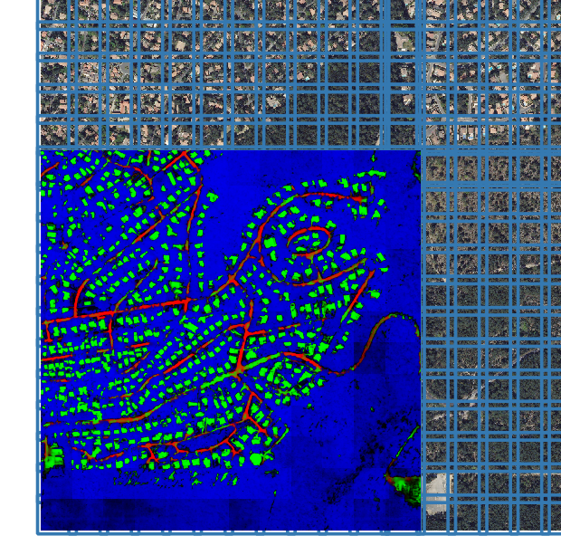
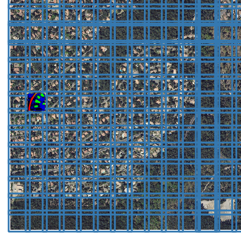
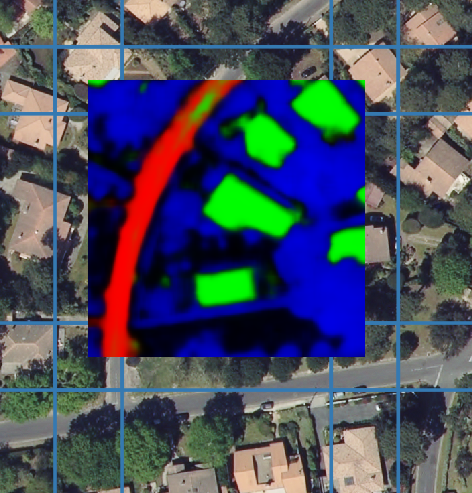

*************
Detect How To
*************

The ``detect`` script performs a detection of two kinds:

* batch detection on a dataset: based on a directory path, a regex pattern
  URI list, or a csv file of file.
* batch detection on a zone: based on a geographical extent.

.. mermaid::

   graph TB

      SubGraph1Flow
      subgraph "Dataset Detection"
      SubGraph1Flow(Iterate over patch images and detect) -->
      SubGraph1Flow
      end

      SubGraph2Flow
      subgraph "Zone Detection"
      SubGraph2Flow(write on formatted dalle?)
      SubGraph2Flow(slide window on zone and detect) -->
      SubGraph2Flow
      end

      subgraph "Odeon detect -c /path/to/my/config/file.json"
      Node1[load configuration] --> Node2[check configuration]
      --> Node3[configure the job]
      Node3 -- Choice1 --> SubGraph1Flow
      Node3 -- Choice2 --> SubGraph2Flow

    end

Command
=======

.. code-block:: console

   $ odeon detect -c /path/to/my/my/conf/file.json

Configuration
=============

Common Sections
---------------
 
image (optional section)
^^^^^^^^^^^^^^^^^^^^^^^^

``img_size_pixel (optional, integer, default value: 256, minimal value: 1)``:
the size of in pixel of your input images in case of a dataset detection.
The size of your patch window in case of a detection by zone.

``resolution (optional, float or list of float, default value: 0.2, minimal value: 1)``:
the resolution in x and y axis of your input patches / images in the model.
A resampling will be applied on the fly if it's necessary.

.. details:: Example of image configuration

   .. code-block:: json
      
      { "image": {"img_size_pixel": 256, "resolution": 0.2} }

model (required section)
^^^^^^^^^^^^^^^^^^^^^^^^
``model_name (required, string)``:
the name of the chosen model for your detection.

``file_name (required, string)``: absolute path of your saved model file.
We actually only accept state dictionary saved model, not the entire model
method (to see the distinction in pytorch, go to 
`saving and loading model recipes for pytorch <https://pytorch.org/tutorials/recipes/recipes/saving_and_loading_models_for_inference.html>`_

.. details:: Example of model configuration

   .. code-block:: json 
      
      { 
       "model_name": "deeplab",
       "file_name": "/media/hd/dataset_1_0-2_256_grid/models/deeplab_test_1.pth"
      }

output_param (required)
^^^^^^^^^^^^^^^^^^^^^^^

``output_path (required, string)``: output path for your model outputs.

``output_type (required, string, one value among 'bit', 'uint8', 'float32')``:
type of your output predictions, between bit, 8 bits integer and float 32 bits.

``sparse_mode (optional, boolean, default value false)``: rather output
sparse geotif files, to minimize space occupation on disk. This option
is only used in combination of output_type set as 'bit' and threshold.

``threshold (optional, float, default value 0.5)``: threshold used to
output 0/1 value when output_type is set to "bit"

``n_classes``: the number of classe of your model.

.. details:: Example of output_param configuration

   .. code-block:: json 

      { "output_param": {
        "output_path": "/path/to/output/dir/",
        "output_type": "bit",
        "threshold": 0.5,
        "sparse_mode": true,
        "n_classes": 5
        }
      }

detect_param (required)
^^^^^^^^^^^^^^^^^^^^^^^

``batch_size (optional, integer, default value 1, minimum value 1)``:
size of input batch in your model

``use_gpu (optional, boolean, default value true)``: 
rather use a gpu for your inference.

``interruption_recovery (optional, boolean, default value false)``: 
recovery option. The detect process logs every operation done and to be
done and save them in a file.
If set to true, the process will load an existing job and start when the
job has been interupted.

``mutual_exclusion (optional, default value false)``: 
In a multiclass detection contest, rather use a softmax activation function
or a sigmoïd. In general, you may use a softmax for a multiclass detection
with monolabel and no background pixels.
In the other cases like multilabel or monolabel with background, you may prefer sigmoïd.

.. details:: Example of detect_param configuration

   .. code-block:: json 
      
      { "detect_param": {
            "batch_size": 1,
            "use_gpu": true,
            "interruption_recovery": false,
            "mutual_exclusion": true,
            "num_worker": 1,
            "num_thread": 8 }
      }

Task Sections
-------------

One of the two sections below is required by odeon detect.

Dataset Section
^^^^^^^^^^^^^^^
.. warning::
   required if Zone section is not filled

``path (required, string)``: The path of your dataset, or a csv
with a list of your patch files on the first column.

``image_bands (optional, array)``: a list of integer representing the band
to extract from your raster(s)

.. details:: "Example of Dataset configuration"

   .. code-block:: json 

      {
        "dataset": {
          "path": "/path/to/csv/file.csv",
          "image_bands": [1,3,4] }
      }

Zone Section
^^^^^^^^^^^^^^^
.. warning::
   required if dataset section is not filled

``sources (required, dictionary of band_name:path)`` : A dictionary of
raster layer. They will be used to build the tile images.
A raster layer is declared as follow: ::
  
  "name_of_raster_entity": {
     "path": "/path/to/raster",
     "bands": a list of integer representing the band to extract from your raster(s)
  }

``extent (required, string or array)``: A geo-polygon file compatible with the fiona library
(such as ESRI shapefile, geojson, geopackage) with one or more
region of interest representing the zone(s) where the detection will be done.

``out_dalle_size (optional, integer)``: you can use it if you want an
output in a list of file with a size in the unit format of your crs to
make more formatted outputs based on your business habits.
It minimizes the number of tile output. 

One dalle of a detection with output_dalle set to 1000 (1km in our unit crs)

One patch of its patch

``dem``: if set to true and a "DTM" and "DSM" band are declared in sources,
it will compute a digital elevation model ("DSM" - "DTM") to replace them

``margin_zone (optional, integer, default 0, minimum 0)``: slice window with
an overlapping height and width, to keep only the center of detection as
output. 
It normally brings better overall performance on overall accuracy, beause
the border pixels have less context than center pixels. 

*Example of overlapping* :  you can see that the patch has its four borders
shared with four others patches, but at the end we keep only the patch less its margin.

``tile_factor (optionan integer, default 4, minimum 1)``: the multiplication
factor of the image size, used to make detection on big patch.
It's another way to batch than batch size. Based on papers, it should make
better predictions.

.. details:: "Example of Zone configuration"
   
   .. code-block:: json 

      {
       "zone":{
          "sources":{
          "RGB": {
              "path": "/PATH/TO/RVB/zone_1.tif",
              "bands": [1, 2, 3] },
          "CIR": {
              "path": "/PATH/TO/IRC/zone_1.tif",
              "bands": [1] },
          "DSM": {
              "path": "/PATH/TO/MNS/zone_1.tif",
              "bands": [1] },
          "DTM": {
              "path": "/PATH/TO/MNT/zone_1.tif",
              "bands": [1]}
           },
       "extent":  "/PATH/TO/learning_zones/zone_1.shp",
       "tile_factor": 2,
       "margin_zone": 50,
       "dem": true
      }
