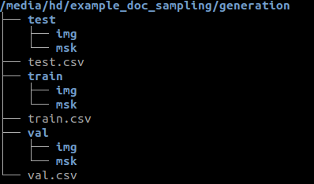

***************
Generate how-to
***************

Summary
=======

Generation_grid performs a dataset generation (with different split option)
over a georeferenced set of input with one or more extents as learning
(training) zones.

This script takes as input:

* one or more csv files of sampled points (sampled with the sampler_grid
  tool of ODEON by example)
* Raster files, with bands (rgb tif, IRC, 13-Channels sat image, DSM, DTM, etc.)
  compatible with a Gdal driver
  (see `gdal driver manual <https://gdal.org/drivers/raster/>`_)
* vector file, in a fiona compatible format. One vector file by classe
  (see `fiona manual <https://fiona.readthedocs.io/en/latest/manual.html>`_ )

The script output 3 directories (train, val, and test) and 2 subdirectories
in each, img and mask.

The size of the tiles are based on the configuration option image_size.
The total number of tuple(img, msk) of tiles is equal to the total number
of sampled points.
    
**Example of output tree structure** (a csv file is attached to each
directory as potential input of the train CLI tool)

         
The generate tool is called like this: 

.. code-block:: console
   
   $ odeon generate -c /path/to/my/json/config/file/my_json_config_file.json

You have a -v option for debug (it's a very verbose option , there's
a real impact on time execution).

Configuration
=============

The json configuration file in input of CLI command contains 4 sections: 
 
  * `Image <Image section_>`_
  * `Image_layers <Image_layers section_>`_
  * `Vector_classes <Vector_classes section_>`_
  * `Generator <Generator section_>`_
  
Image section
-------------

Configuration of the output patches
'''''''''''''''''''''''''''''''''''

* `image_size_pixel (optional, integer, default value 256)`:
  pixel size of height and width 
* `resolution (float or list of float, optional, default value 0.2)`:
  resolution in x and y in CRS unit

Image_layers section
--------------------

A dictionary of raster layer. They will be used to build the tile images.
A raster layer is declared as follow: ::
   
   "name_of_raster_entity": {
    "path": "/path/to/raster" or ["/path/to/raster/1", ... ,"/path/to/raster/n"],
    "bands": a list of integer representing the band to extract from your raster(s) 
   }

Example of declaration:

.. code-block::
   
   { 
    "RGB": {
        "path": "/media/hd/tests_data/33/RVB/33_2015_zone_1_1.tif",
        "bands": [1, 2, 3] }
   }

Another example of declaration with a sequence of raster (batch mode)

.. code-block:: json
   
   {
    "CIR": {
      "path": ["/data/33/ground_truth/2015/A2_IRC/irc.vrt", "/data/33/ground_truth/2018/IRC/irc.vrt"],
      "bands": [1, 3] }
   }

    
Vector_classes section
----------------------

A dictionary with "class_name" as key and ["file_paths"] as value with
file_path a list of files encoded in a fiona compatible driver (esri
shapefile, geojson, geopackage...). There must be one (class_name : file_paths)
pair by class

They will be used to generate the tile masks which is a stack of raster bands
(number equal to the number of declared classes) with 0/1 values.

Example of declaration

.. code-block:: json
   
   {
      "vector_classes": {
        "bitumen" : "/media/hd/tests_data/bitume.shp",
        "building": "/media/hd/tests_data/bati.geojson",
        "water" : "/media/hd/tests_data/eau.shp",
        "tree": "/media/hd/tests_data/ligneux.pkg.gpkg",
        "minerals": "/media/hd/tests_data/mineraux.pkg.gpkg"}
   }

Example of declaration with a list of vector file by class (batch mode)

.. code-block:: json
   
   {
    "vector_classes": {
         "bitumen" : [
             "/data/mask_bitume_33_2015_reprises.shp",
             "/data/mask_bitume_33_2018_all.pkg.gpkg"],
         "building": [
             "/data/mask_bati_33_2015.shp",
             "/data/mask_bati_33_2018_all.pkg.gpkg"],
         "tree": [
             "/data/mask_ligneux_33_2015_reprises.shp",
             "/data/mask_ligneux.pkg.gpkg"],
         "minerals": [
             "/data/mask_mineraux_33_2015_reprises.shp",
             "/data/mask_mineraux.pkg.gpkg"] }
   }
   
Generator section
----------------------

This section includes configuration options to split the sampled points
in train/test/val and other options relatives to the directory paths,
plus some extras:

* ``output_path (required, string, path to output directory)``: the output directory,
  where the dataset will be generated. 1, 2 or 3 directories will be generated inside
  (depending on the split configuration): train, val, test.

* ``poi_pattern (required, string with an optional regex pattern or array of string)``: 
  the input csv files (the output of one of the ODEON sampling or one of made by yourself),
  formated with semicolon and no header. The expected csv format is: x, y, where x is the
  x geocoordinate of the center of your tile and y the y geocoordinate. 

  - Examples of possible declaration : 
  
    /data/my_csv.csv or /data/*.csv or /data/my_prefix*.csv.

  - Examples of possible declaration in the array case: 

    [/data/my_csv-1.csv, ...,/data/my_csv-n.csv] or [/data/my_csv-1/*.csv, ...,/data/my_csv-n/*.csv]

* ``train_test_split (optional, float between 0 and 1)``: 
  the percentage of the training part over the testing part when we do the train/test split

* ``train_val_split (optional, float between 0 and 1)``: 
  the percentage of the training part over the validation part when we do the train/valt split

* ``compute_only_masks (optional, boolean, default value false)``: 
  when we activate it, we compute only the mask

* ``dem (optional, boolean, default value false)``:
  rather we create a DEM (digital elevation model) band as the substration
  of DSM and DTM (whose has to be present in the image_layers declaration).
  Be careful, this option is centered on specific needs for our team.
  You should prefer declare your own DEM band in the image_layers section. 

* ``append (optional, boolean, default value false)``:
  Appends patches if a dataset exists already in the output_path , or purge
  everything and create a fresh new Dataset if set to False. This option is
  interesting if you need to update an existing dataset (the csv will be updated too).

Example of configuration
========================

The json schema of the generation configuration file can be found at
odeon/scripts/json_defaults/generation_schema.json

Here is an example of json configuration

.. code-block:: json

   {
      "image": {
        "image_size_pixel": 128,
        "resolution": 0.2
      },
      "image_layers": {
        "RGB": {
          "path": "/media/hd/tests_data/33/RVB/33_2015_zone_1_1.tif",
          "bands": [1, 2, 3]
        },
        "CIR": {
          "path": "/media/hd/tests_data/33/IRC/33_2015_zone_1_1.vrt",
          "bands": [1, 2, 3]
        }
      },
      "vector_classes": {
        "building": "/media/hd/VECTOR/33_2015_zone_1_1_bati.shp",
        "bitumen" : "/media/hd/VECTOR/33_2015_zone_1_1_bitume.geojson",
        "water" : "/media/hd/tests_data/33_2015_zone_1_1_eau.shp",
        "tree": "/media/hd/tests_data/33_2015_zone_1_1_ligneux.shp",
        "minerals": "/media/hd/tests_data/33_2015_zone_1_1_mineraux.shp",
        "pool": "/media/hd/tests_data/33_2015_zone_1_1_piscine.shp"
      },
      "generator": {
        "output_path": "/media/hd/out/test_dev/generation",
        "poi_pattern": "/media/hd/out/test_dev/sampling/zone1_2015_zone_33_1_1.csv",
        "train_test_split": 0.8,
        "train_val_split": 0.8,
        "compute_only_masks": false,
        "dem": true,
        "append": false
      }
   }

.. details:: Here is another example of json configuration in batch mode

   .. code-block:: json

      {
          "image": {
            "image_size_pixel": 256,
            "resolution": [0.2, 0.2]
          },
          "image_layers": {
            "RGB": {
              "path": [
                  "/home/dlsupport/data/33/ground_truth/2015/A1_RVB/rvb.vrt",
                  "/home/dlsupport/data/33/ground_truth/2018/RVB/rvb.vrt"],
              "bands": [1, 2, 3]
            },
            "CIR": {
              "path": [
                  "/home/dlsupport/data/33/ground_truth/2015/A2_IRC/irc.vrt",
                  "/home/dlsupport/data/33/ground_truth/2018/IRC/irc.vrt"],
              "bands": [1, 2, 3]
            }
          },
          "vector_classes": {
            "bitumen" : [
                "/data/33/ground_truth/2015/mask_bitume_33_2015_reprises.shp",
                "/data/33/ground_truth/2018/mask_bitume_33_2018_all.shp"],
            "building": [
                "/data/33/ground_truth/2015/mask_bati_33_2015.shp",
                "/data/33/ground_truth/2018/mask_bati_33_2018_all.shp"],
            "tree": [
                "/data/33/ground_truth/2015/mask_ligneux_33_2015_reprises.shp",
                "/data/33/ground_truth/2018/mask_ligneux_33_2018_zones_1_3_5.shp"],
            "minerals": [
                "/data/33/ground_truth/2015/mask_mineraux_33_2015_reprises.shp",
                "/data/33/ground_truth/2018/mask_mineraux_33_2018_all.shp"]
          },
          "generator": {
            "output_path": "/media/hd/out/test_33_bimillesime/generate",
            "poi_pattern": [
                 "/media/hd/out/test_33_bimillesime/sample_grid/2015*.csv",
                 "/media/hd/out/test_33_bimillesime/sample_grid/2018*.csv"],
            "train_test_split": 0.7,
            "train_val_split": 0.7,
            "compute_only_masks": false,
            "dem": true,
            "append": false
          }
        }

Possible options of split
=========================

You may not need to split your dataset as Train/Val/Test.
Actually, every option is possible. Here is how you can achieve that :

+-----------------------+------------------+-----------------+
| Mode                  | train_test_split | train_val_split |
+=======================+==================+=================+
| Only train            | don't declare    | don't declare   |
+-----------------------+------------------+-----------------+
| Only val              | don't declare    | 0               |
+-----------------------+------------------+-----------------+
| Only Test             | 0                | don't declare   |
+-----------------------+------------------+-----------------+
| train/val split       | don't declare    | 0.x             |
+-----------------------+------------------+-----------------+
| train/test split      | 0.x              | don't declare   |
+-----------------------+------------------+-----------------+
| val/test split        | 0                | 0.x             |
+-----------------------+------------------+-----------------+
| train/val/test split  | 0.x              | 0.x             |
+-----------------------+------------------+-----------------+

.. tabs::

   .. tab:: Only train
     
      Just don't declare the train_test_split and the train_val_split options.
      
      .. code-block:: json

         { "generator": {
              "output_path": "/path/to/generate",
              "poi_pattern": "pat/to/poi",
              "compute_only_masks": false,
              "dem": true,
              "append": false}
         }

   .. tab:: Only val
      
      don't declare train_test_split
      
      .. code-block:: json

         { "generator": {
              "output_path": "/path/to/generate",
              "poi_pattern": "pat/to/poi",
              "train_val_split": 0,
              "compute_only_masks": false,
              "dem": true,
              "append": false}
         }

   .. tab:: Only Test
   
      don't declare train_val_split

      .. code-block:: json

         { "generator": {
              "output_path": "/path/to/generate",
              "poi_pattern": "pat/to/poi",
              "train_test_split": 0,
              "compute_only_masks": false,
              "dem": true,
              "append": false}
        }

   .. tab:: train/val split
   
      don't declare train_test_split "train_val_split": value > 0
      
      .. code-block:: json

         { "generator": {
              "output_path": "/path/to/generate",
              "poi_pattern": "pat/to/poi",
              "train_val_split": 0.7,
              "compute_only_masks": false,
              "dem": true,
              "append": false}
         }

   .. tab:: train/test split
      
      "train_test_split": value > 0 don't declare train_val_split
      
      .. code-block:: json

         { "generator": {
              "output_path": "/path/to/generate",
              "poi_pattern": "pat/to/poi",
              "train_test_split": 0.7,
              "compute_only_masks": false,
              "dem": true,
              "append": false}
         }

   .. tab:: val/test split
   
      "train_test_split": value > 0 "train_val_split": 0
      
      .. code-block:: json

         { "generator": {
              "output_path": "/path/to/generate",
              "poi_pattern": "pat/to/poi",
              "train_val_split": 0,
              "train_test_split" : 0.7,
              "compute_only_masks": false,
              "dem": true,
              "append": false}
         }

   .. tab:: train/val/test split
   
      "train_test_split": value > 0 "train_val_split": value > 0
      
      .. code-block:: json

         { "generator": {
              "output_path": "/path/to/generate",
              "poi_pattern": "pat/to/poi",
              "train_val_split": 0.7,
              "train_test_split": 0.7,
              "compute_only_masks": false,
              "dem": true,
              "append": false}
         }

Batch Mode
==========

As quickly introduced above, you can generate your dataset from one set
of input data, or from a list of set of input data. 

**What do we mean by set of input data ?**

a set of input data is the aggregation of the image_layers section, the
vector_layers section and the poi_pattern field. 
They configure your input data (rasters for the image tile, vectors for the mask tile,
and csv for the window of the tile).
In some case, you may need more than one set of input data to make a splited dataset ready 
for training.

**When do we need more than on set of input data ?**

You should handle most of your business by virtualizing your rasters in a VRT,
but there is at least two cases where the batch mode can be useful:

* Temporal data or multi-view data: you have different view of the same extent,
  at different moment or different angle and you want to train your data  all
  together to make your model more robust to changing.
* Massive amount of data: if you have millions of raster , you may prefer
  to build a list of VRT for time optimization.

Obviously, the lists declared in the image_layer section ,the vector_layer section and 
the poi_pattern section.

Generate output as Train input
==============================

The main purpose of this tool is to prepare your data for training. 
The csv(s) or the directory paths of the train/val datasets are totally
compatible as input of training.

Encoding
========

we accept any rasterio supported encoding as input. The output encoding
will be 8 bits integer or 16 bits integer, the rule of thumb being if an
input raster is in 16 bits, the output will be 16 bits, else it will be
8 bits.
If an input raster is not in the output encoding format, the bands extracted
from  it will be rescaled on the output encoding specter before casting.

Warning
=======

We make a pre-rasterization of all the vectors before generating the mask tiles. 
Some possible errors are tolerated during this phase:

* out of bounds error
* memory error (if a polygon has a very huge extent and you have not sufficient memory)

A warning will be spread.
