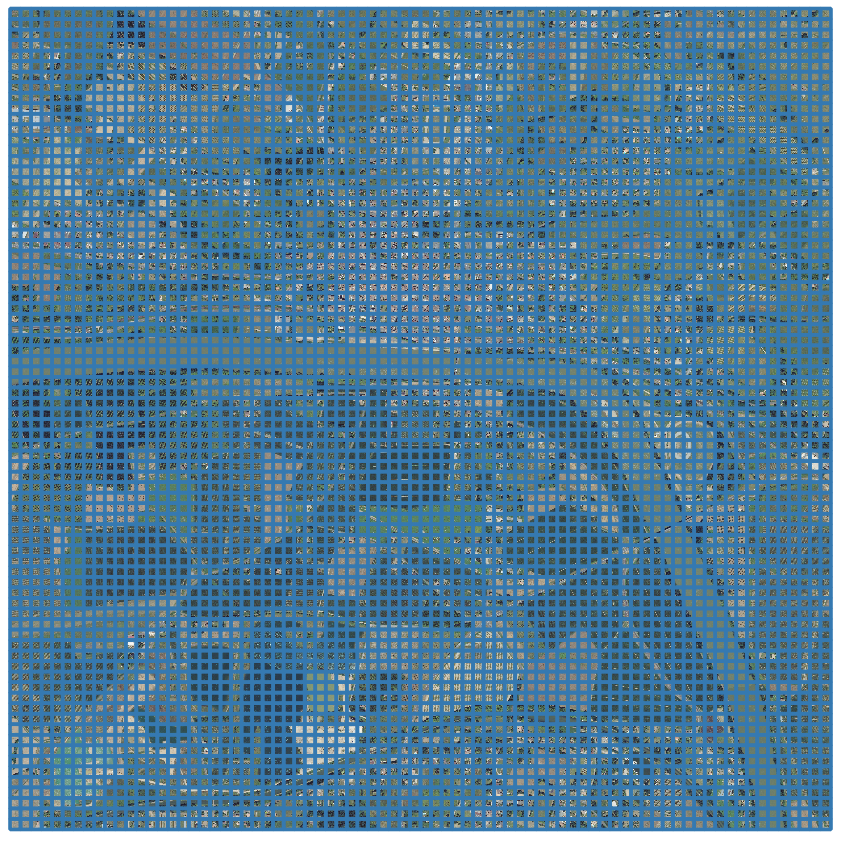

******************
Sample grid how-to
******************

``sample_grid`` script performs a regular sampling over one or several zones.

This is one possibility for the first step (out of two) to build a dataset.
This is suited if you have areas with ground truth for all your classes.   

The goal is to generate a list of (x,y) coordinates :
 * from each shape in a shapefile
 * equally distributed (uniform distribution)
 * allowing an (image,mask) to be completely inside the shape  

Visualization of the result of a grid sampling :

The output contains as many files as there are shapes in the given shapefile.
Each file is a list of coordinates from one shape. The shape are ordered in x, then y.

To launch the code, simply type ``odeon sample_grid -c <config.json>``.
You can add ``-v`` in order to have a verbose output.

Example :

.. code-block:: console

   $ odeon sample_grid -c ../tests/test_sampler_grid.json -v 

Json file content
=================

The full json file is :

.. code-block:: json

    {
      "image": {
        "image_size_pixel": 256,
        "resolution": 0.2
      },
      "sampler": {
        "input_file": "/home/data/33/ground_truth/2018/learning_zones/zone_all.shp",
        "output_pattern": "/media/hd/example_doc_sampling/normal/2018-*.csv",
        "shift": false,
        "tight_mode": false
      }
    }

Image section
-------------

"image" describes the size and resolution of the future samples in the dataset:

* ``image_size_pixel`` (optional, integer, default value: 256): 
  the number of pixels per side (usually a power of 2)

* ``resolution`` (optional, float or list of float, default value: 0.2): 
  the resolution expressed in CRS unit, for instance 0.2 means 0.2m per pixel

This information has to be consistent with the following steps : generation of the dataset and training.

Sampler section
---------------

"sampler" contains information regarding the way the sampling will be performed:

* ``input_file (required, string)``: a file in any fiona accepted file
  format containing a list of shapes (avoid concave polygons)

* ``output_pattern (required, string or regex pattern)``: the directory
  where to store the output csv with a regex pattern option to set a
  prefix to the output files (useful to make distinction between different
  sampling output)

  Examples : "../../odeon_test/\*_regularsampling.csv" and
  "/hd/odeon_test/regularsampling.csv" are valid inputs.

* ``strict_inclusion (optional, boolean, default value: false)``: use
  it if your extent or one of your extents is not squared, in this case 
  it will only sample tiles strictly included in your extent.

* ``shift (optional, boolean, default value: false)``:  this option will
  shift the offset of the grid representation (the upper left corner).
  It's a useful option if you use the same extend in different moment of time, 
  like in a multi-year training (combined with batch mode in the generate tool)

  - Example with shift :
   
    .. figure:: assets/sample_grid_shift.png
       :align: center
       :figclass: align-center

  - Example without shift :
   
    .. figure:: assets/sample_grid_normal.png
       :align: center
       :figclass: align-center

* ``tight_mode (optional, boolean, default value: false)``: tight every
  tile of the grid to the offset (upper left corner) when your extend
  is not a multiple of the desired tile size.

  - Example with tight_mode : 
    there is no  space between tiles and a big space on the right and
    bottom of the extent.
  
    .. figure:: assets/sample_grid_tight_mode.png
       :align: center
       :figclass: align-center

  - Example without tight_mode :
    the extent is not a multiple of the tile size and the rest is spread
    all over the grid. 
  
    .. figure:: assets/sample_grid_not_tight.png
       :align: center
       :figclass: align-center
