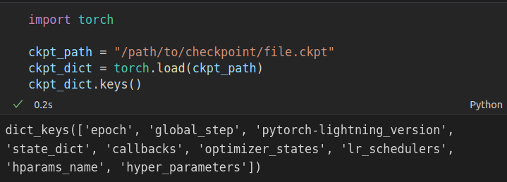
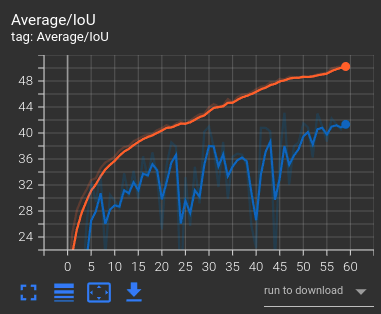
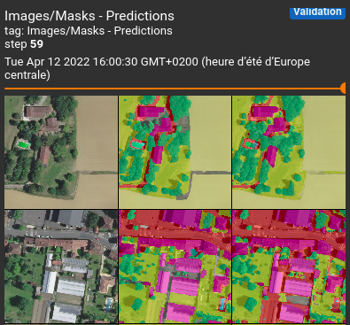
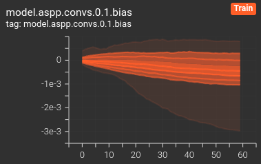
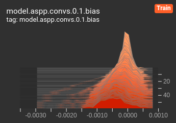

============
Train - How To
============

Summary
=======

The train tool performs the training loop of a segmentation model.

The main inputs of the training step are:
 
* **description of data sources**: csv files for train dataset and optionnaly for validation dataset. 
  Those files must describe each tuple image/label files. This part will also contains the data 
  augmentation and the normalization of the dataset.

   .. details:: Example of csv file 
   
      ::

      /path/to/dataset/train/img/15-7826_4-2467_0.tif,/path/to/dataset/train/msk/15-7826_4-2467_0.tif
      /path/to/dataset/train/img/15-7586_4-2492_1.tif,/path/to/dataset/train/msk/15-7586_4-2492_1.tif
      /path/to/dataset/train/img/15-8091_4-2272_3.tif,/path/to/dataset/train/msk/15-8091_4-2272_3.tif
      /path/to/dataset/train/img/15-8038_4-2541_4.tif,/path/to/dataset/train/msk/15-8038_4-2541_4.tif

* **setup of the training**: name of the model, hyperparameters
* **setup of the outputs**: choose loggers, output folders to write checkpoints and history files.
* **setup of the device**: define the number(s) or id(s) of device(s), distributed strategy ...

The train tool is called like this:

.. code-block:: console
   
   $ odeon train -c /path/to/my/json/config/file.json

A -v option is available for debug, using it increases the training time.

Configuration
=============

The JSON configuration file in input of CLI command contains 4 sections:

* `Data source <Data source_>`_
* `Train setup <Train setup_>`_
* `Output setup <Output setup_>`_
* `Device setup <Device setup_>`_

Here is a short example of a configuration file needed for train process,
and a long config with a detailed description of each part:

.. details:: Minimal configuration file

   .. code-block:: json

        { 
          "data_source": {
              "train_file": "/path/to/train_set.csv",
              "val_file": "/path/to/val_set.csv",
              "test_file": "/path/to/test_set.csv",
              "image_bands": [1, 2, 3],
              "mask_bands": [1,2,3,4,5,6,7,8,9,10,11,12,13,14,15]
              },
          "output_setup": {
                "output_folder": "/path/to/output/folder/",
                "name_exp_log": "ocsge_test_32"
              },
          "train_setup": {
                "model_name": "unet",
                "epochs": 3,
                "batch_size": 3,
                "loss": "ce",
                "lr": 0.01
              },
          "device_setup": {
                "accelerator": "gpu",
                "device": 1
              }
        }

.. tabs::

   .. tab:: Data Source
     
      .. code-block:: json

         { "data_source": {
              "train_file": "/path/to/train_set.csv",
              "val_file": "/path/to/val_set.csv",
              "test_file": "/path/to/test_set.csv",
              "image_bands": [1, 2, 3],
              "mask_bands": [1,2,3,4,5,6,7,8,9,10,11,12,13,14,15],
              "class_labels": [
                  "batiment","zone_impermeable","zone_permeable","piscine","sol_nu","surface_eau","neige","coupe",
                  "peuplement_feuillus","peuplement_coniferes", "lande_ligneuse","vigne","culture","terre_arable",
                  "autre"
              ],
              "normalization_weights": {
                    "train": {
                        "mean": [0.45368713, 0.46235293, 0.3989958],
                        "std": [0.1898824, 0.15448096, 0.1556343]
                    },
                    "val": {
                        "mean": [0.43193138, 0.4490423, 0.390175],
                        "std": [0.11976098, 0.10639796, 0.11044782]
                    },
                    "test":{
                        "mean": [0.4442997, 0.45902625, 0.39637628],
                        "std": [0.12020385, 0.10600946, 0.10955668]
                    }
              },
              "data_augmentation": {
                  "train": ["rotation90"],
                  "val": [],
                  "test": []
              }
          }

   .. tab:: Output Setup
      
      .. code-block:: json

         { "output_setup": {
              "output_folder": "/path/to/output/folder/",
              "model_filename": "filename.ckpt",
              "name_exp_log": "ocsge_test_32",
              "version_name": "version_lr_0.01",
              "get_prediction": true,
              "prediction_output_type": "uint8",
              "use_tensorboard": true,
              "use_wandb": false,
              "log_learning_rate": true,
              "save_history": true,
              "save_top_k": 5,
              "progress" : 1
            }
         }

   .. tab:: Train Setup

      .. code-block:: json

         { "train_setup": {
                "model_name": "unet",
                "epochs": 3,
                "batch_size": 3,
                "loss": "ce",
                "class_imbalance": [1,1,1,1,1,1,1,1,1,1,1,1,1,1,0],
                "lr": 0.01,
                "optimizer_config": {
                    "optimizer": "sgd",
                    "momentum": 0.5
                },
                "scheduler_config": {
                    "scheduler": "reducelronplateau",
                    "patience": 1,
                    "cooldown": 0,
                    "factor": 0.5,
                    "min_lr": 1e-7
                },
                "early_stopping": {
                      "patience": 30,
                      "monitor": "val_loss"
                },
                "continue_training": false,
                "random_seed": 42,
                "val_check_interval": 0.5,
                "deterministic": true,
                "testing": true
              }
          }

   .. tab:: Device Setup

      .. code-block:: json

         { "device_setup": {
              "accelerator": "gpu",
              "device": 2
              "num_nodes": 1,
              "num_workers": 4,
              "num_processes": 1,
              "strategy": "ddp"
            }
          }

   .. tab:: Full Configuration

      .. code-block:: json

          { 
            "data_source": {
                "train_file": "/path/to/train_set.csv",
                "val_file": "/path/to/val_set.csv",
                "test_file": "/path/to/test_set.csv",
                "image_bands": [1, 2, 3],
                "mask_bands": [1,2,3,4,5,6,7,8,9,10,11,12,13,14,15],
                "class_labels": [
                    "batiment","zone_impermeable","zone_permeable","piscine","sol_nu","surface_eau","neige","coupe",
                    "peuplement_feuillus","peuplement_coniferes", "lande_ligneuse","vigne","culture","terre_arable",
                    "autre"
                ],
                "normalization_weights": {
                      "train": {
                          "mean": [0.45368713, 0.46235293, 0.3989958],
                          "std": [0.1898824, 0.15448096, 0.1556343]
                      },
                      "val": {
                          "mean": [0.43193138, 0.4490423, 0.390175],
                          "std": [0.11976098, 0.10639796, 0.11044782]
                      },
                      "test":{
                          "mean": [0.4442997, 0.45902625, 0.39637628],
                          "std": [0.12020385, 0.10600946, 0.10955668]
                      }
                },
                "data_augmentation": {
                    "train": ["rotation90"],
                    "val": [],
                    "test": []
                    }
                },
            "output_setup": {
                "output_folder": "/path/to/output/folder/",
                "model_filename": "filename.ckpt",
                "name_exp_log": "ocsge_test_32",
                "version_name": "version_lr_0.01",
                "get_prediction": false,
                "use_tensorboard": true,
                "use_wandb": false,
                "log_learning_rate": true,
                "save_history": true,
                "save_top_k": 3,
                "progress" : 1
                },
            "train_setup": {
                "model_name": "unet",
                "epochs": 3,
                "batch_size": 3,
                "loss": "ce",
                "class_imbalance": [1,1,1,1,1,1,1,1,1,1,1,1,1,1,0],
                "lr": 0.01,
                "optimizer_config": {
                    "optimizer": "sgd",
                    "momentum": 0.5
                },
                "scheduler_config": {
                    "scheduler": "reducelronplateau",
                    "patience": 1,
                    "cooldown": 0,
                    "factor": 0.5,
                    "min_lr": 1e-7
                },
                "early_stopping": {
                      "patience": 30,
                      "monitor": "val_loss"
                },
                "continue_training": false,
                "random_seed": 42,
                "val_check_interval": 1.0,
                "deterministic": true,
                "testing": true
                },
            "device_setup": {
                "accelerator": "gpu",
                "device": 1
                }
        }

Data source
-----------

* ``train_file (str)``: 
  Path to the CSV file containing the data in the train split which should be used for the training.

* ``val_file (str, optional)``: 
  Path to the CSV file containing the data for in the validation split which should be used for the training.
  If not provided, the data for the validation split will be obtained by splitting the data in the train file
  using the percentage_val parameter, by default None.

* ``test_file (str)``: 
  Path to the CSV file containing the data for in the test split which should be used for the training.
  If provided, metrics will be computed on those data or predictions will be made if the, by default None.

* ``percentage_val (float, optional)``:
  If the validation file (``val_file``) is not specified this parameter will be used to split the training
  data into a training split and a validation split. For example, if percentage_val = 0.3, then 0.7
  of data from train_file will be used in the train split and 0.3 will be used for the validation split,
  by default 0.3.

* ``image_bands (List[int], optional)``: 
  A list of band indices of the image to use for the training. Only specified bands of input images will be
  used in training. List of the channel  If this parameter is not provided, all the bands of the image will
  be selected, by default None.

* ``mask_bands (List[int], optional)``:
  A list of band indices of the mask (classes) to use for the training. Only specified bands of input masks will be
  used in training. If this parameter is not provided, all the bands of the mask will be selected,
  by default None.

* ``class_labels (List[str], optional)``:
  List of the labels for each class used for the training. Should have the same number of value as mask_band
  parameter. If None, labels will be "class 1", "class 2" ... to "class n" for every class selected,
  by default None.

* ``resolution (Union[float, Tuple[float], List[float]], optional)``:
  Resolution of the image in the dataset. Could be define for the whole dataset or for each split.

* ``normalization_weights (Dict[str, List[float]], optional)``:
  Dict of stats (mean, std) for each split (train/val/test) to do a mean std normalization: (X - mean) / std.
  Those stats are in range 0-1 for each image band used in training. If not provided, the normalization will
  be by scaling values in range 0-255 to 0-1, by default None.

* ``data_augmentation (Dict[str, List[float]], optional)``:
  Dictionary defining for each split the data augmentation transformation that one want to apply. Available
  data augmentation are rotation90 and radiometry or both. Now data augmentation can only be applied to the
  training set and not on the validation or test set. If nothing is defined the transformation on the data
  will be only a normalization and casting of array to tensor, by default None.  
  See `Augmentation description <Augmentation description_>`_.

Train setup
-----------

* ``model_name (str)``:
  Name of the architecture model to use to do the training. Available models are "unet",
  "lightunet", "resnet18", "resnet34", "resnet50", "resnet101", "resnet150", "deeplab".
  See `Model description <Model description_>`_.

* ``epochs (int, optional)``: 
  Number of epochs for which the training will be performed, by default 1000.

* ``batch_size (int, optional)``:
  Number of samples used in a mini-batch, default 3.

* ``lr (float, optional)``:
  Starting learning rate for the training, by default 0.001.
  
* ``loss (str, optional)``:
  Loss function used for the training. Available parameters are "ce": cross-entropy loss, "bce":binary cross
  entropy loss, "focal": focal loss, "combo": combo loss (a mix between "bce", "focal"), by default "ce".  
  See `Losses description <Losses description_>`_.

* ``class imbalance (List[str], optional)``:
  A list of weights for each class. Weights will be used to balance the cost function.
  Usable only when `loss` is set to `ce`, default None.

* ``optimizer_config (Dict[str, Union[int, float, str], optional)``:
  A dictionary containing parameters for the optimizer. Available optimizer are: "adam", "radam", "adamax",
  "sgd", "rmsprop". The parameters of each optimizer are configurable by entering the name of the parameter
  as a key and the associated value in the configuration dictionary (you can look at the pytorch
  documentation of those classes at https://pytorch.org/docs/stable/optim.html), by default None.  
  See `Optimizer description <Optimizer description_>`_.

* ``scheduler_config (Dict[str, Union[int, float, str], optional)``:
  A dictionary containing parameters for the scheduler. Available scheduler are: "reducelronplateau",
  "cycliclr", "cosineannealinglr", "cosineannealingwarmrestarts". The parameters of each scheduler are
  configurable by entering the name of the parameter as a key and the associated value in the configuration
  dictionary (you can look at the pytorch documentation of those classes at
  https://pytorch.org/docs/stable/optim.html). By default,`ReduceLROnPlateau <https://pytorch.org/docs/stable/optim.html?highlight=reducelronplateau#torch.optim.lr_scheduler.ReduceLROnPlateau_>`_ 
  is used as learning rate scheduler with mode='min', factor=0.5, patience=10, min_lr=1e-7, cooldown=4`.

* ``continue_training (boolean, optional)``:
  Parameter to resume a training from a former trained model. A training could only be resume from a
  checkpoint file (and not from a .pth file). If the parameter is set to true, the model to resume will
  be search at the defaut checkpoint save path "odeon_{monitor}_ckpt" .by default False.

* ``export_checkpoint (Union[str, List[str]], optional)``:
  Additional format to export saved checkpoint. Mainly useful for backward compatibility with previous
  version of odeon and "pth" model format.

* ``val_check_interval (float, optional)``:
  How often to check the validation set. Pass a float in the range [0.0, 1.0] to check after a fraction of
  the training epoch. Pass an int to check after a fixed number of training batches, by default 1.

* ``deterministic (Dict, optional)``:
  If True, sets whether PyTorch operations must use deterministic algorithms, by default False.

* ``random_seed (int, optional)``:
  Value used to initialize the random number generator. The random number generator needs a number to start
  with (a seed value), to be able to generate a random number, by default 42.

* ``testing (Dict, optional)``:
  Have to be used for modifications testing or debugging. If set to True, only a subset of the data will
  be used in the training pipeline, by default False.

Output setup
-----------

* ``output_folder (str)``:
  Path where the output files will be stored. Outputs files will be at least the training
  model (.ckpt or .pth). In addition, one could logs training metrics in tensorboard, and/or
  a single file dictionary, and/or in Weight & Biases (wandb). If a CSV file for the test
  set is provided, metrics will be computed or predictions could be also done with trained
  model (using the one with the best validation metrics at an epoch).
  path to output folder. Model files and tensorboard logger are stored by default. 
  If `save_history` is set to true in, a JSON file with values by epoch is saved.

* ``model_filename (str, optional)``:
  Name for the output trained model. The name of the output depend on the extension type of the output model
  (could be define in model_out_ext). If model type is ".ckpt" there will multiple output trained models and
  each will contains the basename of the input model_filename. If model type is ".pth" there will only one
  trained model with name defined in the model_filename parameter, and three files are saved during training:
  `${model_filename}.pth` and `optimizer_${model_filename}.pth` in order to store the `state_dict`
  of model and optimizer and also `train_${model_filename}.pth` to store additional information on the
  training. When the model improves, thoses files are overwritten, by default, None.

* ``model_out_ext (str, optional)``:
  Define the extension to use for model filename. If not provided the output trained model will be of type
  ".ckpt" which is default extension for pytorch lightning, by default None.

* ``name_exp_log (str, optional)``:
  Name of the experience of the training (for example unet_ocsge). The folder will be inside the output
  folder if it doesn't exists it will be created. If this parameter is not provided the name of the
  experience will be the day the training have been launched(ex: 2022-06-17), by default None.

* ``version_name (str, optional)``:
  Name of the version of the training (for example version_0) which will be inside the experience folder.
  This system of version allows the user to have easily multiple versions of one experience, those versions
  could be the same or with little tweaks in the configuration files. If this parameter is not provided the
  name of the version will be the time at which the training have been launched (ex: 17-08-53),
  by default None.

* ``get_prediction (boolean, optional)``:
  Parameter could be only used if the test_file is provided. The predictions will be made with the mode with
  the best val_loss model and the predictions will be sotred in a predicitons folder inside the experience
  folder, by default False.

* ``prediction_output_type (boolean, optional)``:
  Type of the output predictions. This parameter will be used only if the parameter "get_prediction"
  is set to True. The output types available are "bit", "uint8", "float32", by default "uint8".

* ``use_tensorboard (boolean, optional)``:
  If set to by default True. The metrics of the training will be stored with tensorboard loggers. For a
  training there will be a logger for the train and validation (and test if test_file is provided) phases.
  Each logger will contains metrics, model graph, distributions and histograms of model's weights, and also
  images with their related masks anf predictions, by defaut True.

* ``use_wandb (boolean, optional)``:
  If set to True, the metrics will be logged using Weight and Biases (wandb) logger. This WANDB logger allows
  to save the metrics and also the code used for the training. The output files will be stored as local files
  and also will be synchronized in the web application of WANDB (https://wandb.ai), by default False.

* ``log_learning_rate (boolean, optional)``:
  If set to True, the value of the learning rate (and its momentum) will be logged, by default False.

* ``save_history (boolean, optional)``:
  Parameter to save the metrics of the training for the validation phase for each epoch (could be also done
  for test phase if test_file is provided) in JSON file, by default True.
  flag to activate the saving of history.   
  See `History File Description <History file description_>`_.

* ``save_top_k (int, optional)``:
  Number of checkpoints saved by training (for a monitored metric). The checkpoints will be selected
  according to a monitored metrics, here we watch two metrics: the validation loss (we keep the k models
  with the lowest val_loss) and the mIoU (macro IoU/mean of IoU per class) on the validation set (we keep
  the k models with the highest val_miou), so if k=3 we will save 6 checkpoints. This parameter is only
  used if output trained model is of type ".ckpt", by default 3.

* ``progress (int, optional)``:
  Determines at which rate (in number of batches) the progress bars get updated. Set it to 0 to disable
  the display. By default, the Trainer uses this implementation of the progress bar and sets the refresh
  rate to the value provided to the progress_bar_refresh_rate argument in the Trainer, by default 1.

Device setup
-----------

* ``device (Union[List[int], str, int], optional)``:
  Number(s) or id(s) of device(s) to use. Will be mapped to either gpus, tpu_cores, num_processes or ipus,
  based on the accelerator type, by default None. For example to select a gpu device could be 1 (int type),
  or "0" (str type) to target the device with id "cuda:0". The selection of two gpus will look like: 2 (int)
  that will select the two first gpus available, or to select by ids the device parameter could also be
  [0, 1] to target the gpus with "cuda:0" and "cuda:1". If device = 0, the device selected will be the "cpu".
 
* ``accelerator (str, optional)``:
  Supports passing different accelerator types (“cpu”, “gpu”, “tpu”, “ipu”, “hpu”, “auto”) as well as custom
  accelerator instances, by default None.

* ``num_nodes (int, optional)``:
  Number of GPU nodes for distributed training, by default 1.

* ``num_workers (int, optional)``:
  How many subprocesses to use for data loading. 0 means that the data will be loaded in the main process,
  by default 4.

* ``num_processes (int, optional)``:
  Number of processes for distributed training with accelerator="cpu", by default 1.

* ``strategy (str, optional)``:
  Supports different training strategies with aliases as well custom strategies. In order to do multi-gpus
  training use the strategy ddp, by default None.

Model description
=================

U-Net
-----

.. code-block:: json

   { 
     "model": "unet"
   }
   

The original U-Net (` U-Net: Convolutional Networks for Biomedical Image Segmentation <https://arxiv.org/abs/1505.04597>`_)implementation.

.. code-block:: python
   
   # encoder
   self.inc = InputConv(n_channels, 64, batch_norm=True)
   self.down1 = EncoderConv(64, 128, batch_norm=True)
   self.down2 = EncoderConv(128, 256, batch_norm=True)
   self.down3 = EncoderConv(256, 512, batch_norm=True)
   self.down4 = EncoderConv(512, 1024, batch_norm=True)
   # decoder
   self.up1 = DecoderConv(1024, 512, batch_norm=True)
   self.up2 = DecoderConv(512, 256, batch_norm=True)
   self.up3 = DecoderConv(256, 128, batch_norm=True)
   self.up4 = DecoderConv(128, 64, batch_norm=True)

   # last layer
   self.outc = OutputConv(64, n_classes)
   

Light U-Net
-----------

.. code-block:: json

   { 
        "model": "lightunet"
   }

A light implementation of original U-Net  with a small number of feature
channels model is used here.

.. code-block:: python

   # encoder
   self.inc = InputConv(n_channels, 8)
   self.down1 = EncoderConv(8, 16)
   self.down2 = EncoderConv(16, 32)
   self.down3 = EncoderConv(32, 64)
   self.down4 = EncoderConv(64, 128)
   # decoder
   self.up1 = DecoderConv(128, 64)
   self.up2 = DecoderConv(64, 32)
   self.up3 = DecoderConv(32, 16)
   self.up4 = DecoderConv(16, 8)

   # last layer
   self.outc = OutputConv(8, n_classes)

U-Net + ResNet
--------------

.. code-block:: json

   {
    "model": ["resnet18", "resnet34", "resnet50", "resnet101", "resnet152"]
   }

U-Net model using `ResNet`_ (18, 34, 50, 101 or 152) encoder.

The torchvision resnet implementation is reused here as encoder of a U-Net
shaped network. The first convolutional layer is overwritten to fit the
number of input channels of the images (which can be greater than 3).

An option is available in model constructor to use wether a bilinear
interpolation (`nn.Upsample <https://pytorch.org/docs/stable/generated/torch.nn.Upsample.html?highlight=upsample#torch.nn.Upsample>`_
with `scale_factor=2`) or a deconvolution (`nn.ConvTranspose2d <https://pytorch.org/docs/stable/generated/torch.nn.ConvTranspose2d.html?highlight=convtranspose2d#torch.nn.ConvTranspose2d>`_
with `stride=2`) in decoder layers.

DeeplabV3+
----------

.. code-block:: json

   {
      "model": "deeplab"
   }

The `DeeplabV3+`_ model is built from DeeplabV3 modules available in torchvision. 

The implementation is inspired by what has been done in `tensorflow <https://github.com/tensorflow/models/tree/master/research/deeplab>`_

.. code-block:: python

   def __init__(self, n_channels, n_classes, output_stride=8):
      ...
      self.backbone = MobileNetV2(n_classes=n_classes, n_channels=n_channels)
      self.aspp = ASPP(320, dilatations)
      self.decoder = Decoder(n_classes, type(self.backbone).__name__)

   def forward(self, input):
      x, low_level_feat = self.backbone(input)
      x = self.aspp(x)
      x = self.decoder(x, low_level_feat)

      x = F.interpolate(x, size=input.size()[2:], mode='bilinear', align_corners=True)

      return x

The backbone is built upon `MobileNetV2`_
implemented in torchvision.
The first layer is rewritten to accept a number of channels different from 3.
Low features are extracted to be reinjected in deeplab decoder.

Atrous Spatial Pyramid Pooling module is `ASPP <https://github.com/pytorch/vision/blob/4521f6d152875974e317fa247a633e9ad1ea05c8/torchvision/models/segmentation/deeplabv3.py#L65>`_.

Decoder combines low level features extracted from MobileNetV2 backbone to features from ASPP.

Losses description
==================

Implemented losses are:

* ``ce`` for CrossEntropyLoss. 
  The `CrossEntropyLoss <https://pytorch.org/docs/stable/generated/torch.nn.CrossEntropyLoss.html>`_
  fonction is computed between predictions of shape(B, C, W, H) and labels of shape (B, W, H)
  (with B=batch_size, C=n_classes, W=width, H=height).
  An argmax function is applied on original labels represented in a tensor with shape (B, C, W, H).
  The `class_imbalance` parameter can be used with this loss to rescale weight given
  to each class in loss calculation.

* ``bce`` uses the `BCEWithLogitsLoss <https://pytorch.org/docs/stable/generated/torch.nn.BCEWithLogitsLoss.html?highlight=bcewithlogitsloss#torch.nn.BCEWithLogitsLoss>`_
  pytorch builtin function. It combines Binary Cross Entropy Loss with a sigmoid.

* ``focal`` implements the Focal Loss describe in the 
   `original paper <https://arxiv.org/pdf/1708.02002.pdf>`_.

* ``combo`` is a loss function using the Jaccard Index.
  It is implemented as a weight combination of BCE and Jaccard Index `(0.75*BCE + 0.25*jaccard)`.

Optimizer description
=====================

Available optimizers:

* ``adam``: 
  `Adam <https://pytorch.org/docs/stable/optim.html?highlight=adam#torch.optim.Adam>`_

* ``SGD``: 
  `SGD <https://pytorch.org/docs/stable/optim.html?highlight=adam#torch.optim.SGD>`_

Scheduler description
=====================

Available scheduler:

* ``adam``: 
  `Adam <https://pytorch.org/docs/stable/optim.html?highlight=adam#torch.optim.Adam>`_

* ``SGD``: 
  `SGD <https://pytorch.org/docs/stable/optim.html?highlight=adam#torch.optim.SGD>`_

Augmentation description
========================

* ``rotation``: 
  random rotation applied to image and mask. 

* ``rotation90``: 
  random rotation of (0, 90, 180 or 270 degrees) applied to image and mask.

* ``radiometry``: gamma, hue variation and noise applied to image and mask
  with a probability of 0.5 for each effect. Gamma factor is randomly picked
  in [0.5, 2.2], Hue variation in [0, 0.066] and Gaussian noise with a
  variance in [0.001, 0.01].

Outputs
=======

The training loop writes in the output directory several files at the end
of an epoch. An update of files is triggered when the model has improved
in the current epoch (the calculated loss on validation dataset has decreased).
The model and optimizer state are stored in a checkpoint, an history file in JSON format
(if ``save_history=True``) is updated with the metrics values.

History file description
------------------------

For each epoch, all metrics, the loss and the learning rate will be saved in the history files.

.. details:: history file example

   .. code-block:: json

        {
            # For each epoch (epoch id saved as str)
            "0": {
              "cm_macro": [...],
              "cm_micro": [...],
              # For a metric, there will be results for Overall, Average and per class strategy
              "Overall/Accuracy": 0.0073115029372274876,
              "Average/Accuracy": 86.66764831542969,
              "class 1/Accuracy": 88.3169174194336, ..., "class n/Accuracy": 73.16143798828125, # this metric on other classes
              # Same process for other metrics
              ... 
              "loss": 1.8587653636932373,
              "learning rate": 0.01
            }
            ...,
            "n": {
                "cm_macro": [...],
                "cm_micro": [...],
                ...
        }

Checkpoint description
---------------------

Checkpoints allows to put back the LightningModule (main element in the pipeline doing the training) at the precise state
when the checkpoint have been saved. This checkpoint will contains the weights of the model and of the optimmizers, and all
the parameters that have been passed to launched this former training.

Tensorboard description
--------------

With a tensorboard logger will will save:
 - the metrics evolution
 - samples of images, masks and predictions
 - the graph of the model
 - distribution of the weights in the model
 - histograms of the weights of the model

For furthermore informations you can refer to the tensorboard documentation: https://www.tensorflow.org/tensorboard/get_started
In pytorch, there is a wrapper code which will be applied over the orignal tensorboard in order to make it 
work with their framework: https://pytorch.org/docs/stable/tensorboard.html.

Metrics example:

Images example

Distribution example:

Histogram example:

