***************
Metrics How To
***************

``metrics`` script compute metrics in order to analyse the quality of a model's predictions.
The tool compute metrics, plot confusion matrices (cms) and ROC curves.
This tool handles binary and multiclass cases with prediction in 'soft' or 'hard' probabilities.

To launch the code, type:
 ``odeon metrics -c <config.json>``.

Example :

.. code-block:: console

   $ odeon metrics -c ../path/to/my/conf/file.json

The metrics computed
====================

Binary case
-----------

- Confusion matrix (cm)
- (optional) normalized by classes cm.
- Accuracy
- Precision
- Recall
- Specificity
- F1-Score
- IoU
- ROC and PR curves
- AUC Score for ROC/PR curves
- Calibration Curve
- Histogram for each metric

Multi-class case
----------------
- Micro : Micro confusion marix and Precision, Recall, F1-Score, IoU.
- Macro : Global confusion matrix, and compute Precision, Recall, F1-Score, IoU. 
- Per class: same metrics as the binary case for each class. Metrics per class and mean metrics.

Binary case
===========

Confusion Matrix
----------------

The confusion matrix is used to have a more complete picture when assessing the performance of a model. It is defined as follows:

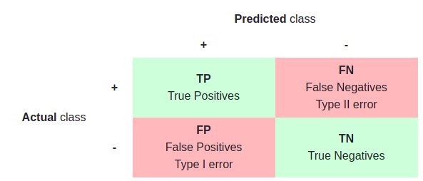

Main metrics
------------

The following metrics are commonly used to assess the performance of classification models:

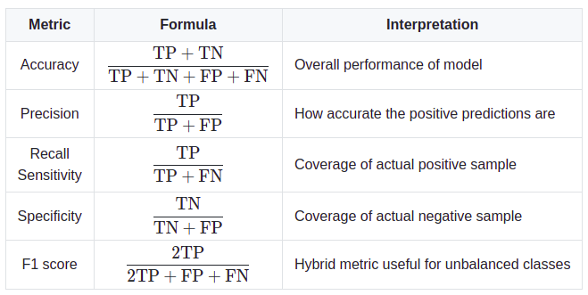

.. details:: For more details, table of metrics with relation between names in Remote Sensing and Deep Learning.

    .. figure:: assets/metrics/metrics_relation_name_RS_DL.png
        :align: center
        :figclass: align-center

    Figure extract from the paper `Accuracy Assessment in Convolutional Neural Network-Based Deep Learning Remote Sensing Studies—Part 1: Literature Review. <https://www.mdpi.com/2072-4292/13/13/2450>`_

ROC Curve
---------

The receiver operating curve, also noted ROC, is the plot of TPR versus FPR by varying the threshold. These metrics are summed up in the table below:

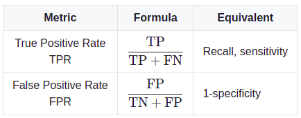

The area under the receiving operating curve, also noted AUC or AUROC, is the area below the ROC as shown in the following figure:

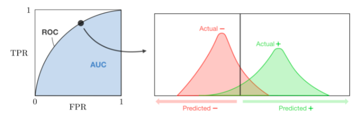

PR Curve
--------

The precision-recall (PR) curve shows the tradeoff between precision and recall for different threshold. 
Precision-Recall is a useful measure of success of prediction when the classes are very imbalanced.

Example of PR curve:

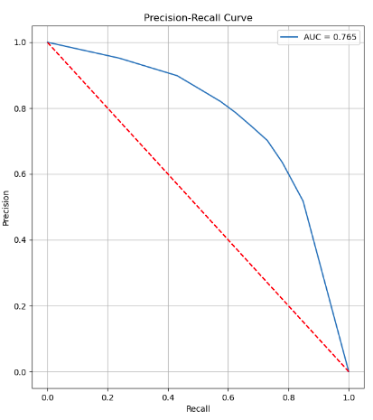

.. warning::
It is possible to enter the number of thresholds used in the computation of ROC and PR curves using the argument ``n_thresholds``.
The more thresholds there are, the more precise the curves will be, but in counterpart it will take more time.

Calibration Curve
-----------------
When performing classification one often wants to predict not only the class label, but also the associated probability.
This probability gives some kind of confidence on the prediction. Calibration is comparison of the actual output and the expected output given by a model.

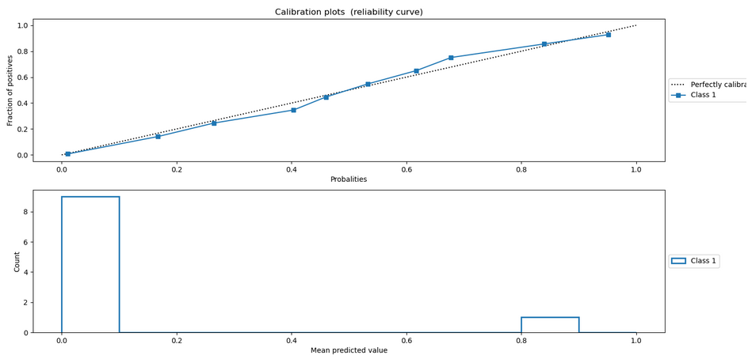

The bottom graph is a histogram representing the distribution of predictions in the input dataset. Thus, for a bin we have the number of pixels in the predictions equal to the value of the bin (for example for the bin 0.2, we have the total number of pixels with a value of 0.2 in all predictions.)

The figure above is a curve showing the percentage of positive values among the observations in each bin. We consider a positive value when the value in the mask is equal to 1. We therefore have a representation of the predicted distribution according to the desired distribution. To compare the obtained curves we can rely on the ``f(x) = y`` line representing a perfectly calibrated model because we want the distributions between the predictions and the ground truth to be similar.

Metrics Histograms
------------------

Histograms representing the values taken for each observation of a metric. These histograms allow to better see the distribution of the values forming the obtained results, because for each strategy the obtained metric is the average value of all the values obtained on the observations composing the dataset.

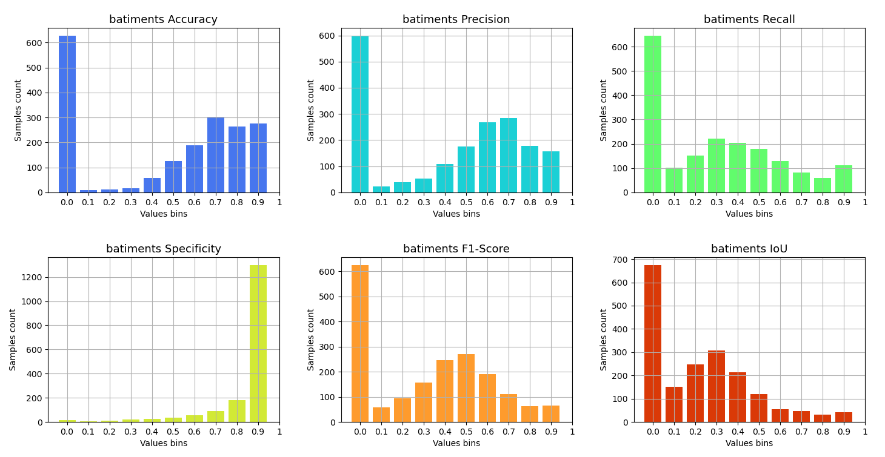

Multiclass case
===============

Micro Strategy
--------------

Micro strategy consists in looking at the performance of a model from a more global point of view.
The quality of a prediction will not be judged by class but by looking at the whole number of TP, FN and FP made by the model.
To do so, each class is first treated as in a binary case (1 vs all) in order to produce a confusion matrix for each class.
The confusion matrices are then added together to form a single matrix which will be our macro confusion matrix.
In micro strategy, precision = recall = F1-score = Overall Accuracy (OA).

.. note::
    The sum of the classes can be done in a pondered way by entering weights argument in the configuration file.
    These weights can be used to rebalance the importance of a class on a metric, or even by setting the weights to 0 for a class,
    this class will not be taken into account for the calculation of macro metrics. 

Example a dataframe with metrics in micro strategy:

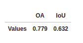

Example of a confusion matrix in micro strategy:
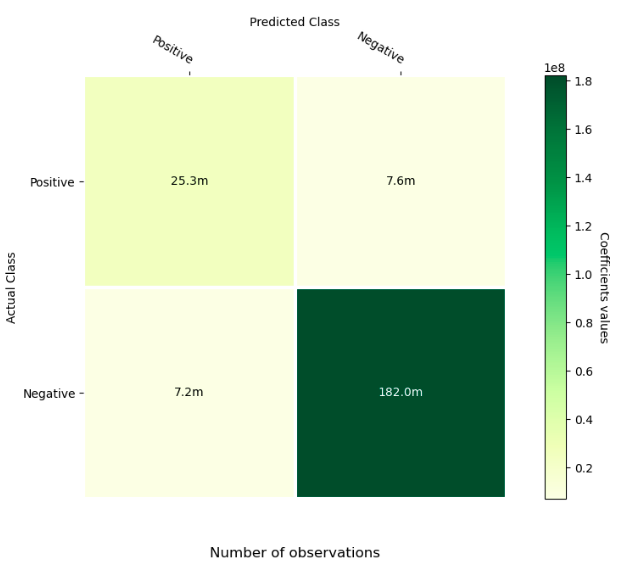

Macro Strategy
--------------

In macro strategy, the metrics are calculated for each classes and then we compute their mean.
The first line 'average' is the unweighted mean, this does not take label imbalance into account.
The second line, 'weighted avg' is the weighted mean. We calculate metrics for each label, and find 
their average weighted by the number of true instances for each label. This alters ‘macro’ to account
for label imbalance; it can result in an F-score that is not between precision and recall.

.. note::
    The user can also compute weighted means using his own weights, by using the parameter `weights`.

Example of confusion matrices:

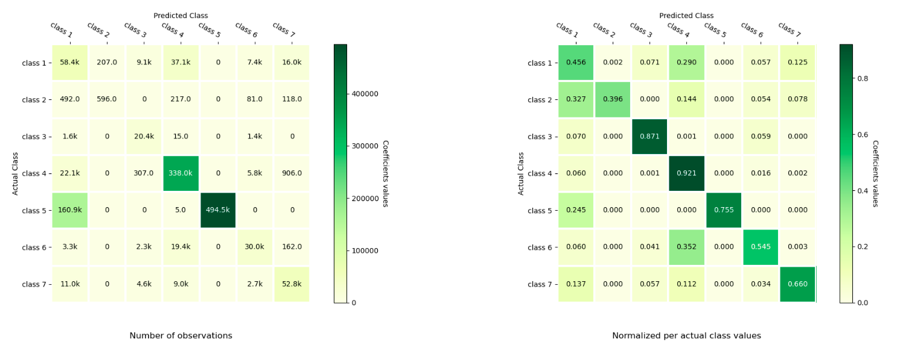

The matrix on the left is the confusion matrix where i-th row and j-th column entry indicates the number of samples with true label being i-th class and predicted label being j-th class.
On the right the confusion matrix is normalized per true label class. 

Example of dataframe containing metrics from macro strategy:

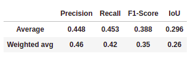

.. note::
    It is possible to have a normalized confusion matrix per class as in the image above right.
    This allows to see for a class the distribution of these predictions. In order to do this you need to use the parameter `get_normalize`.

Per class strategy
------------------

The class strategy is the even more precise view but only looks at the performance of each class one by one and independently. 
Example of a confusion matrix for a class in  a multiclass case, here class A.

.. list-table:: Confusion Matrice for class A
   :widths: 20 20 20 20

   * - 
     - A
     - B
     - C
   * - A
     - TP
     - FN
     - FN
   * - B
     - FP
     - TN
     - TN
   * - C
     - FP
     - TN
     - TN

Example of a dataframe with metrics for each class. The 'Overall' line represents the mean metrics over all classes:

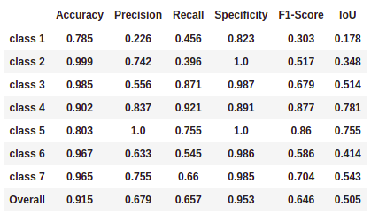

**In the multiclass case, we compute the same ROC, PR, calibration curves and histograms of the metrics as in the binary case
except that this time these metrics are applied to each of the classes in an independent way and will be obtained by taking a
single class and opposing it to the others (1 vs. all)**

Example of ROC and PR curves in multiclass case:

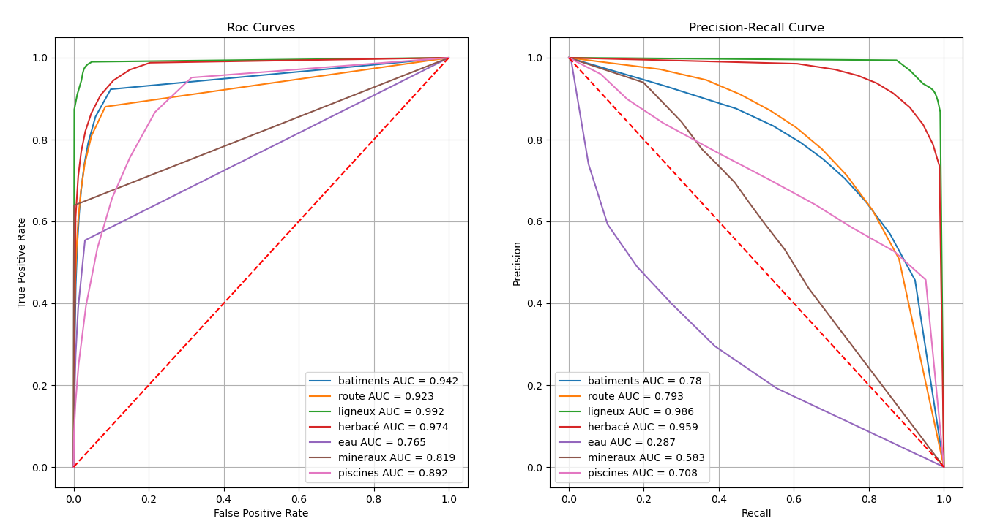

Json file content
=================

Examples of Json config file
----------------------------

.. details:: **minimalist json** (the minimum configuration required to start to compute the statistics)

    .. code-block:: json

        {
            "metrics_setup": {
                "mask_path": "/path/to/intput/folder/msk",
                "pred_path": "/path/to/input/folder/pred",
                "output_path": "/path/to/output/folder/",
                "type_classifier": "binary",
                "in_prob_range": false
                }
        }
 
.. warning::
   By default, the format of the ouput file will be "html".

.. details:: **full json example**

    .. code-block:: json

        {
            "metrics_setup": {
                "mask_path": "/path/to/intput/folder/msk",
                "pred_path": "/path/to/input/folder/pred",
                "output_path": "/path/to/output/folder/",
                "output_type": "html",
                "type_classifier": "multiclass",
                "in_prob_range": false,
                "weights": [0.3, 0.5, 0.0, 0.0, 0.9, 0.1, 0.1],
                "class_labels": ["batiments", "route", "ligneux"],
                "mask_bands": [1, 2, 3],
                "pred_bands": [1, 2, 3],
                "threshold": 0.6,
                "n_thresholds": 10,
                "bit_depth": "8 bits",
                "n_bins": 10,
                "get_normalize": true,
                "get_metrics_per_patch": true,
                "get_ROC_PR_curves": true,
                "get_ROC_PR_values": true,
                "get_calibration_curves": false,
                "get_hists_per_metrics": false
            }
        }

.. warning::
   To describe in more detail the data to be passed as input to the metrics tool, the tool expects to receive a hotencoder tensor for 
   the masks, i.e. each band (third dimension) of the tensor will correspond to a class and the presence of a class on a pixel will 
   be noted by the value 1 if present otherwise 0. The expected predictions must be of the same size as the masks. If the values of
   the predictions are not "probabilities" between 0 and 1, the ``in_prob_range`` parameter must be set to False so that the values
   are changed to be in the range [0, 1].

.. note::
    There is the possibility to calculate metrics only on selected bands. To do so, it is necessary to use the parameters ``mask_bands`` and
    ``pred_bands`` to define the indices of the bands of the classes you want to select in the mask and do the same with the corresponding
    bands in the prediction.
    By selecting bands in the mask and in the prediction we will be able to extract the metrics for each class, some metrics will change.
    For the macro strategy, the metrics per class (Accuracy, Precision, Recall, Specificity, F1-Score and IoU) and also the curves for each
    class (ROC, PR, calibration) will remain the same but the global metrics of this strategy will not. The confusion matrix will keep the
    same values for the selected classes but there will be in addition the integration of a class named 'Other' representing the grouping of
    the non selected classes.
    For the micro strategy, the classes are not the same anymore and the strategy consists in summing the confusion matrices of each class, 
    that's why we won't get the same confusion matrix and metrics in output as if we had used all the bands present in the dataset. 

Description of JSON arguments
-----------------------------

- ``mask_path`` : str, required
    Path to the folder containing the masks.
- ``pred_path`` : str, required
    Path to the folder containing the predictions.
- ``output_path`` : str, required
    Path where the report/output data will be created.
- ``type_classifier`` : str, required
    String allowing to know if the classifier is of type binary or multiclass.
- ``in_prob_range`` : boolean, required
    Boolean to be set to true if the values in the predictions passed as inputs are between 0 and 1.
    If not, set the parameter to false so that the tool modifies the values to be normalized between 0 and 1.
- ``output_type`` : str, optional
    Desired format for the output file. Could be json, md or html.
    A report will be created if the output type is html or md.
    If the output type is json, all the data will be exported in a dict in order
    to be easily reusable, by default html.
- ``class_labels`` : list of str, optional
    Label for each class in the dataset.
    If None the labels of the classes will be of type:  0 and 1 by default None
- ``mask_bands`` : list of int
    List of the selected bands in the dataset masks bands. (Selection of the classes)
- ``pred_bands`` : list of int
    List of the selected bands in the dataset preds bands. (Selection of the classes)
- ``weights`` : list of number, optional
    List of weights to balance the metrics.
    In the binary case the weights are not used in the metrics computation, by default None.
- ``threshold`` : float, optional
    Value between 0 and 1 that will be used as threshold to binarize data if they are soft.
    Use for macro, micro cms and metrics for all strategies, by default 0.5.
- ``n_thresholds`` : int, optional
    Number of thresholds used in the computation of ROC and PR, by default 10.
- ``bit_depth`` : str, optional
    The number of bits used to represent each pixel in a mask/prediction, by default '8 bits'
- ``bins`` : list of float, optional
    List of bins used for the creation of histograms.
- ``n_bins`` : int, optional
    Number of bins used in the construction of calibration curves, by default 10.
- ``get_normalize`` : bool, optional
    Boolean to know if the user wants to generate confusion matrices with normalized values, by default True
- ``get_metrics_per_patch`` : bool, optional
    Boolean to know if the user wants to compute metrics per patch and export them in a csv file.
    Metrics will be also computed if the parameter get_hists_per_metrics is True but a csv file
    won't be created, by default True
- ``get_ROC_PR_curves`` : bool, optional
    Boolean to know if the user wants to generate ROC and PR curves, by default True
- ``get_ROC_PR_values`` : bool, optional
    Boolean to know if the user wants a csv file with values used to generate ROC/PR curves, by default False
- ``get_calibration_curves`` : bool, optional
    Boolean to know if the user wants to generate calibration curves, by default True
- ``get_hists_per_metrics`` : bool, optional
    Boolean to know if the user wants to generate histogram for each metric.
    Histograms created using the parameter threshold, by default True.