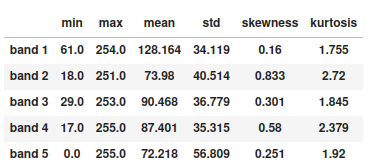
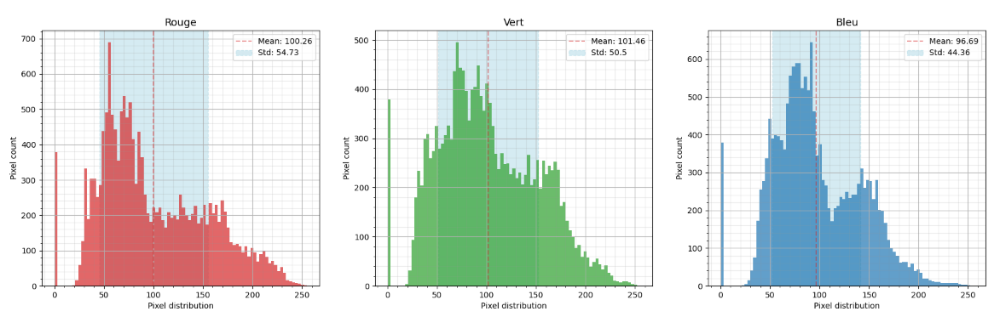
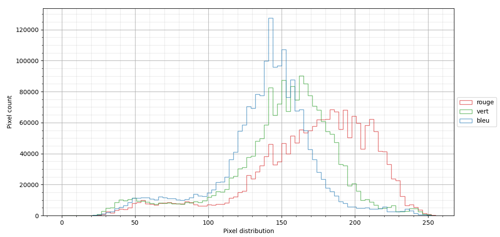
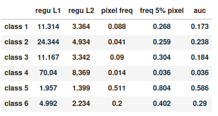
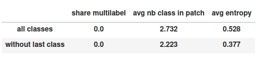
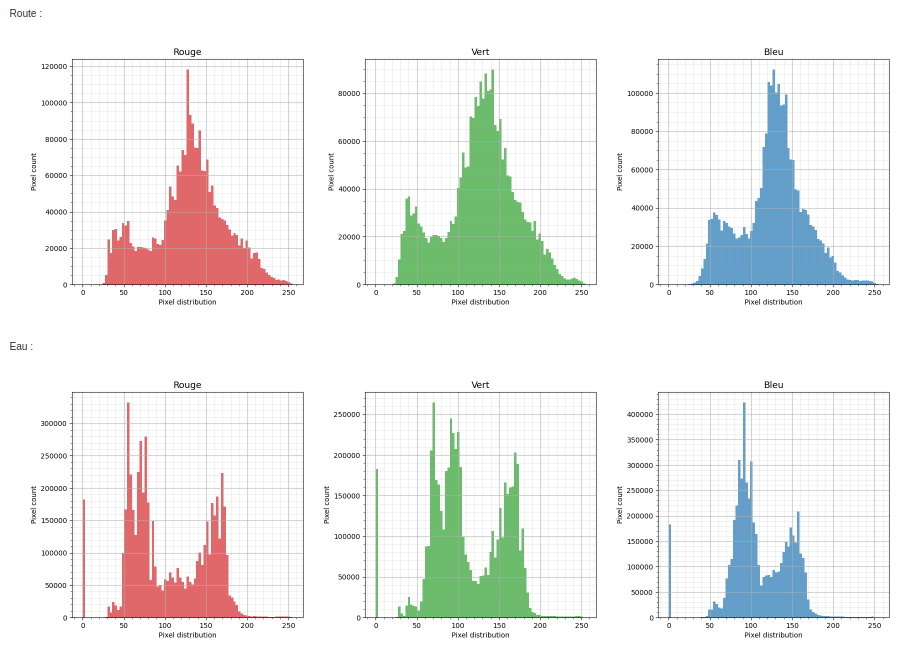

*************
Stats How To
*************

``stats`` script compute descriptive statistics on a dataset according to the following items:

* the bands of the images.
* the classes contained in the masks
* the globality of the dataset
* the radiometry for each class.

As output, the script can either generate a report file (JSON / markdown / HTML).
Another advantage of this tool is that the statistics can be calculated by choosing
the bands of the images and masks we are interested in and applying the desired data augmentation.

To launch the code, type:
 ``odeon stats -c <config.json>``.

Example :

.. code-block:: console

   $ odeon stats -c ../config_files/stats_conf.json

Details on the computed statistics
==================================

Images bands statistics
-----------------------
- ``min``, ``max``: minimum and maximum pixel values for each bands.
- ``mean``, ``std``: mean and standard deviation of the pixel distribution of each band.
- ``skewness``, ``kurtosis``: skewness and kurtosis of the pixel distribution of each band. (optional)
- histograms of pixels distributions per band with selected bins.

Example of a dataframe containing computed statistics:

Example of histograms on the pixels values of each band. The histograms of each band could be displayed on the same figure
or on different figures (thanks to the parameter ``plot_stacked``):

(1) One figure per band:

(2) On the same figure:

.. note::
    To have a clearer statistics report, it is possible to enter the labels you want for the bands of the images and the classes present in the masks. Otherwise the image bands will be named band 1, band 2, etc.. and the classes in the masks will be named class 1, class 2, etc..
    (In order to do so, use the parameters ``bands_labels`` and ``masks_labels``).

Classes statistics
------------------
- ``regu L1``: Class-Balanced Loss Based on Effective Number of
    Samples 1/frequency(i)
- ``regu L2``: Class-Balanced Loss Based on Effective Number of
    Samples 1/sqrt(frequency(i))
- ``pixel freq``: Overall share of pixels labeled with a given class.
- ``freq 5%pixel``: Share of samples with at least 5% pixels of a given class. The lesser, the more concentrated on a few samples a class is.
- ``auc``: Area under the Lorenz curve of the pixel distribution of a given class across samples. The lesser, the more concentrated on a few samples a class is. Equals pixel freq if the class is the samples are either full of or empty from the class. Equals 1 if the class is homogeneously distributed across samples.

Example of a dataframe containing statistics for each class:

Statistics based on the overall dataset
---------------------------------------

Global statistics are computed either with all classes or without the last class if we are not in a binary case.

- ``share multilabel``: Percentage of pixels shared by several classes
- ``avg nb class in patch``: Mean of the number of classes present in each sample
- ``avg entropy``: Mean of the class distribution entropy for each sample. For each sample, the entropy is at least 0 if a single class is represented and at most log(C) with C the number of classes. The entropy of a sample is log(C) if every class is equally represented. The greater the entropy, the semantically richer the sample is.

Example of a dataframe with a dataset global stats:

Radiometry
----------
Here we call as radiometry statistics the distribution of each image's band according to each class.
(Use ``get_radio_stats`` parameter to get those statistics).

In the example above, we can clearly see that the distributions of pixel values vary greatly within each class.

Json file content
=================

**minimalist json** (the minimum configuration required to start to compute the statistics)

.. code-block:: json

 {
  "stats_setup":{
        "input_path": "/path/to/input/dataset/train.csv",
        "output_path" : "/path/to/output/folder/"}
 }

.. warning::
   By default, the format of the ouput fil will be "html".

**full json example**

.. code-block:: json

   {
    "stats_setup": {
        "input_path": "/path/to/input/dataset/train.csv",
        "output_path": "/path/to/output/folder/",
        "output_type": "html",
        "image_bands": [1, 2, 3],
        "mask_bands": [1, 2, 3, 4, 5, 6],
        "bands_labels": ["red", "green", "blue"],
        "class_labels":["batiments", "route", "eau", "herbace", "ligneux", "mineraux", "autre"],
        "get_skewness_kurtosis": true,
        "get_radio_stats": true,
        "plot_stacked": true,
        "bit_depth": "8 bits",
        "batch_size" : 1,
        "num_workers": 1
        }
   }

**Description of JSON arguments**:

- ``input_path`` : str, required
    Path to .csv file describing the input dataset or a directory where the images and masks are stored.
- ``output_path``: str, required
    Path of the folder where the report with the computed statistics will be created. The folder must exist or be created before the use of the tool.
- ``output_type``: str, optional
    Output file format. The output file can only be in md, json, html. By default, the output format will be html.
- ``image_bands``: list of int
    List of the selected bands in the dataset images bands.
- ``mask_bands``: list of int
    List of the selected bands in the dataset masks bands. (Selection of the classes)
- ``bands_labels`` : list of str, optional
    Label for each bands in the dataset, by default None.
- ``class_labels`` : list of str, optional
    Label for each class in the dataset, by default None.
- ``bins``: list, optional
    List of the bins to build the histograms of the image bands, by default None.
- ``nbr_bins``: int, optional
    If bins is not given in input, the list of bins will be created with the
    parameter nbr_bins defined here. If None the bins will be automatically
    defined according to the maximum value of the pixels in the dataset, by default None.
- ``get_skewness_kurtosis``: bool
    Boolean to compute or not skewness and kurtosis, by default False.
- ``bit_depth``: str, optional
    The number of bits used to represent each pixel in an image, , by default "8 bits".
- ``batch_size``: int
    The number of image in a batch, by default 1.
- ``num_workers``: int, optional
    Number of workers to use in the pytorch dataloader, by default 1.
- ``get_radio_stats``: bool, optional
    Bool to compute radiometry statistics, i.e. the distribution of each image's band according
    to each class, by default True.
- ``plot_stacked``: bool, optional
    Parameter to know if the histograms of each band should be displayed on the same figure
    or on different figures, by default False.
